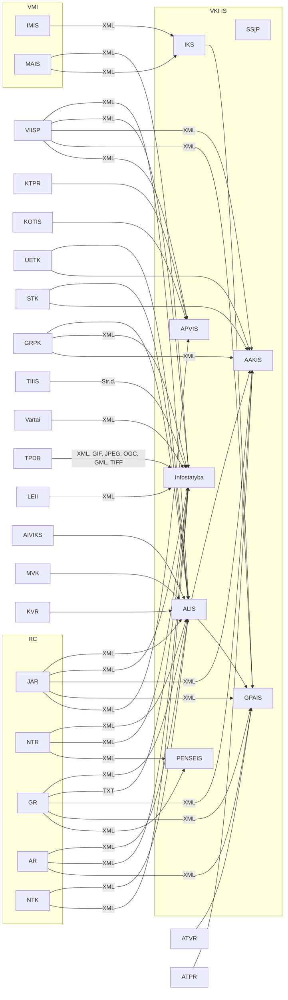

# VIS integracijos
## Kam to reikia?
Ši repozitorija skirta panaudojant Mermaid įrankį surinkti į vieną vietą Lietuvoje turimų informacinių sistemų tarpusavio sąryšius, tam, kad galima būtų susidaryti bendrą vaizdą ir palengvinti Perkančiosioms organizajioms ir IT sprendimų tiekėjams vertinti esamą situaciją ir palengvinti IS kūrimą valstybės mąstu.

## Aplinkos ministerijos valdomų ir jai pavaldžių įstaigų VIS integracijos
### Trumpiniai
VIS - valstybinės informacinės sistemos

<link rel="stylesheet" href="./mermaid.css">

